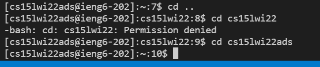
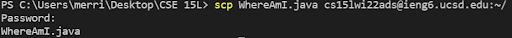
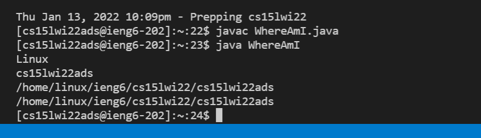
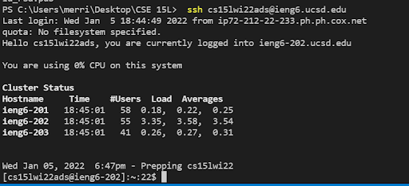
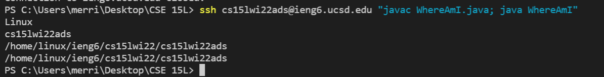

# Overview
This will be a tutorial for using SSH to access the ieng6 servers at UC San Diego. 
It will cover
* Installing VScode
* Connecting with SSH
* Basic CMD commands
* Copying files with scp
* Logging in with SSH key
* Optimizing remote running
Let's get started

## Installing VScode
This tutorial will use [VScode](https://code.visualstudio.com/) as the IDE. 
Once you finish installing VScode, create a new folder and open up the terminal using the menu bar.
Your Screen should look like this:


## Connecting with SSH
Look for your username from [Link]https://sdacs.ucsd.edu/~icc/index.php and type the command
```
ssh cs15lwi22zz@ieng6.ucsd.edu
```
but use your own personal username instead.
The terminal will then ask you for your password, which you will then enter.
(As you type or paste in your password, it will not show up in the terminal.)
You may need to do a password reset for your cs15L account.
Enter "Yes" if it asks if you want to continue connecting.
Your terminal should look like this:


## Basic CMD commands
Now that you've logged in your ieng6 account, you can now run linux command line commands from the server.
Try the commands cd, ls, pwd, mkdir, and cp on your own.
For example, this is what the cd command looks like:


## Copying files with scp
If we have files from our local machine that we want to run on ieng6, we can use scp to copy those files to the server.
Create a java file called "WhereAmI.java".
```
class WhereAmI {
  public static void main(String[] args) {
    System.out.println(System.getProperty("os.name"));
    System.out.println(System.getProperty("user.name"));
    System.out.println(System.getProperty("user.home"));
    System.out.println(System.getProperty("user.dir"));
  }
}
```
Notice the output when you run this file on your own computer.
Next type the command in the directory of the java file.
```
scp WhereAmI.java cs15lwi22zz@ieng6.ucsd.edu:~/
```
Then SSH into ieng6 and use javac and java to run WhereAmI.java.
Notice that the java file prints out ther properties of the server computer.

A successful scp should look like this:


Running the java file on ieng6 should look like this:


## Logging in with SSH Key
To avoid having to type in a password, we can use a SSH Key for our computer.
Type in
```
ssh-keygen
```
Then ssh into ieng6 and type in
```
mkdir .ssh 
```
Log back into your client and type
```
scp /Users/YOURUSERNAME/.ssh/id_rsa.pub cs15lwi22zz@ieng6.ucsd.edu:~/.ssh/authorized_keys
```
This copies your public key into the ieng6 computer. 
If this was successful, logging in will no longer require a password.

On my computer, it looks like this



## Optimizing remote running
We can make remote running faster by using a few tricks.
Typing commands in quotes after the ssh command will immediate run those commands on the server.
Typing commands separated by semicolons will run all the commands.

For example, I can quickly compile and run a java file on ieng6 will the following command:

