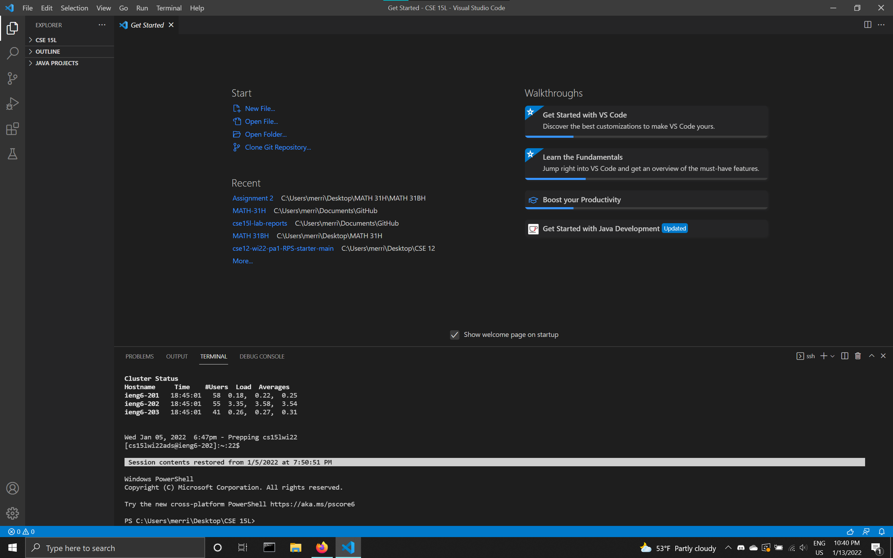
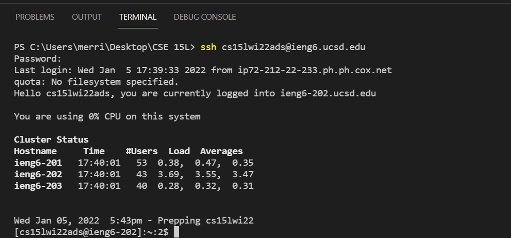

# Overview
This will be a tutorial for using SSH to access the ieng6 servers at UC San Diego. 
It will cover
* Installing VScode
* Connecting with SSH
* Basic CMD commands
* Copying files with scp
* Logging in with SSH key
* Optimizing remote running
Let's get started

## Installing VScode
This tutorial will use [VScode](https://code.visualstudio.com/) as the IDE. 
Once you finish installing VScode, create a new folder and open up the terminal using the menu bar.
Your Screen should look like this:

## Connecting with SSH
Look for your username from https://sdacs.ucsd.edu/~icc/index.php and type the command
> ssh cs15lwi22zz@ieng6.ucsd.edu

but use your own personal username instead.
The terminal will then ask you for your password, which you will then enter.
(As you type or paste in your password, it will not show up in the terminal.)
You may need to do a password reset for your cs15L account.
Enter "Yes" if it asks if you want to continue connecting.
Your screen should look like this:

