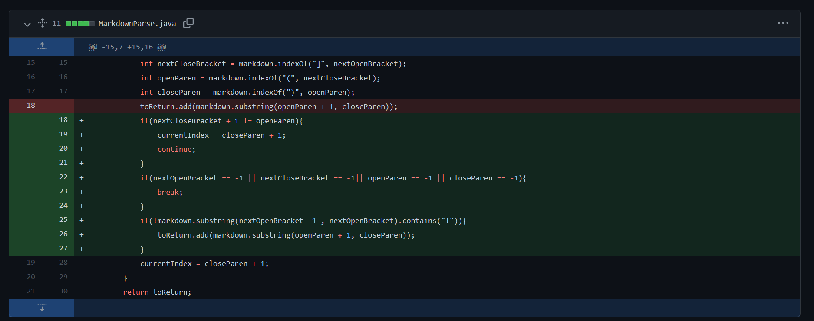
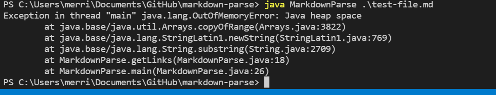
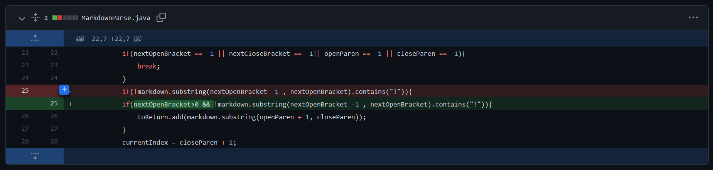
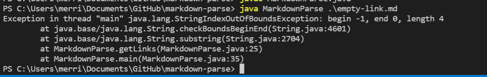

# Lab Report for Weeks 3 and 4
This page contains 3 bugs and the commits that fixed them for lab 3 and 4

## Bug Number 1
Here is the screenshot of the bug fix commit:

The code change fixes the bug induced by [this file](https://github.com/bcli12/markdown-parse/blob/main/image-file.md).
The output of the file from the command line was this before the bug fix:

The file contains a single image, and the symptom was that the markdown file would list the image name as a link even though it isn't a link.
The bug was that the code only checked for brackets to indicate the start of a link while not checking if the brackets were from an image.
The failure inducing input contained a image, the bug caused the program to think that the image name was a link, and
the symptom was that the name of the image was listed.
The code fix is the last added if statement that checks if the brackets are for an image by checking if there is a exclamation point before the open bracket.

## Bug Number 2
There was another code change within the same commit that fixed another bug.

The code change fixes the bug induced by [this file](https://github.com/bcli12/markdown-parse/blob/main/test-file.md).
The output of the file from the command line was:

The file is the original test-file.md but modified so that there was plain text at the end.
The symptom was that the program would crash from a out-of-memory error.
The bug was that the code did not check to see if there were no more links, 
and the code would get stuck in an infinite loop if currentIndex was still within bounds.
The text in the failure inducing input led the program to get stuck in an infinite loop because of the bug, 
and the infinite loop caused the symptom of the memory running out.
The code fix checked if any of the indexes were -1, which meant that there were no more links and the loop could safely exit.

## Bug Number 3
Here is the screenshot of the bug fix commit:

The coe change fixes the bug induced by [this file](https://github.com/merrickqiu/markdown-parse/blob/main/empty-link.md).
The output of the file from the command line was:

The file is a single empty link.
The symptom was an out-of-bounds error
The bug was that the code checked if there was an exclamation point before the brackets, but sometimes the link was at the very beginning of the file.
The link at the beginning led the program to try to index -1 because of the bug, 
and the symptom was java displaying an out of bounds error.
The code fix checked that the bracket index was at least 1 to prevent the code from trying to index -1.
