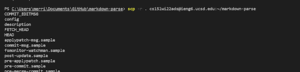
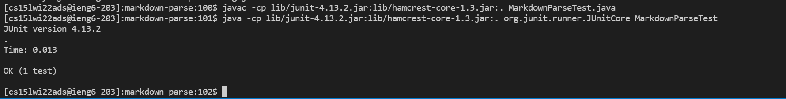
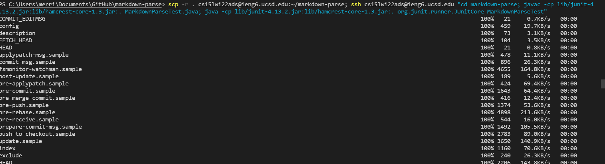

# Copy whole directories with -r

Copying a whole directory into ieng6:



The ```-r``` option tells the command to recursively copy all the folders, i.e. copy all the items inside the inner folders. 
The ```.``` says to copy the root directory, which would be the markdown-parse folder.
Copying a whole directory is a lot more efficient than copying individual files.

Running markdownParseTest in ieng6:


Running markdownParseTest is the same as running it on my local machine, except I need to use colons except for semicolons.
The test passes as it should.

Combining both into one command:

I SCPed the directory, put a semicolon, then SSHed into my account, and then put quotes around the commands to run the tests.
Inside the quotes I CDed into the markdown-parse directory, compiled markdownParseTest, then ran markdownParseTest.
Having one long command is a lot faster than typing in the commands individually.

