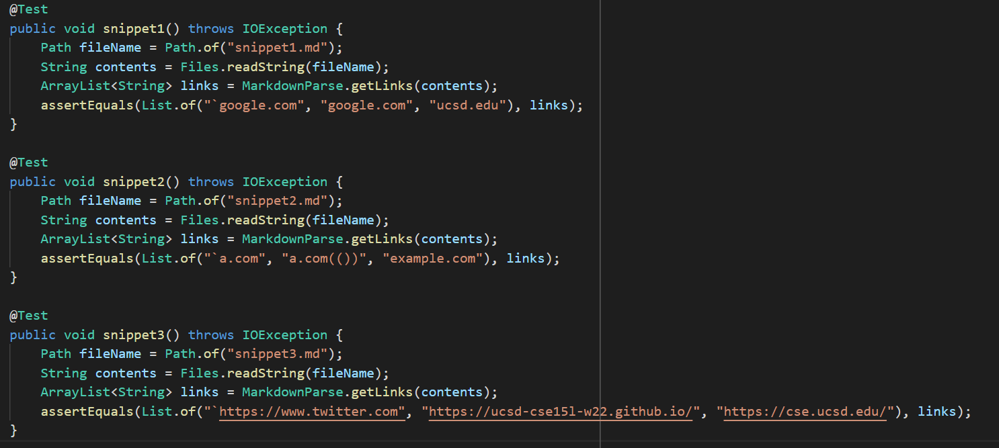
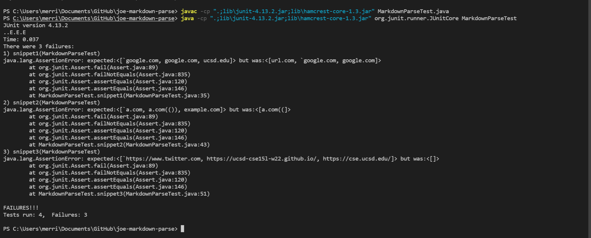
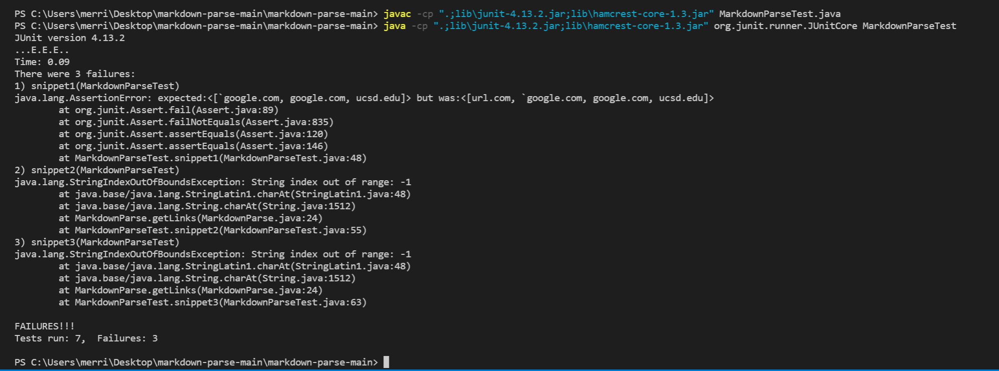

# Links to the repositories
[My Markdownparse](https://github.com/merrickqiu/markdown-parse)
[The Markdownparse I review](https://github.com/TheZenMasterz/markdown-parse)

# Tester code added to both implementations
The three tests I added to both implementations. 
Check the assert statement for the expected output.
(twitter shouldn't have a backtick before it, I fixed it later).

# My implementation output

# Their implementation output

# Snippet 1
My code counts "url.com" even though the open bracket is between backticks, 
and it doesn't count "ucsd.edu" even though the first close bracket is between backticks
I could make my code work for snippet 1 by adding a backtick counter inside the while loop.
This would make sure that brackets inside backticks do not count.

# Snippet 2
My code does not account for nested nested parenthesis, nested links, or escaped brackets.
Each of these individually could be fixed in less than 10 lines, 
but accounting for all of them would likely be a fix of greater than 10 lines.

# Snippet 3
I have regex in my code to check that the link is in the form of characters followed by a period followed by more characters.
Since the newline is not a character, it does not get added to the list. 
This can easily be fixed by stripping the link of whitespace before pattern matching.
