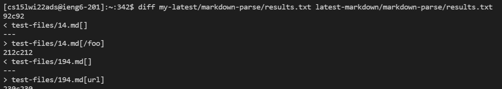
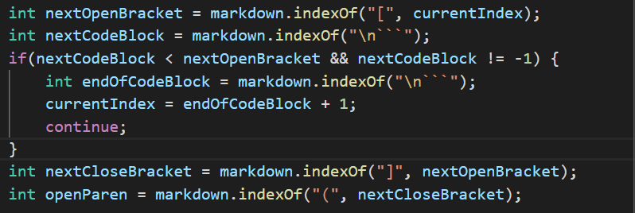
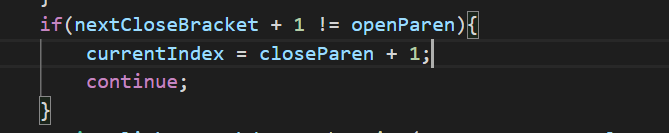

# How did I find the test cases?
I simply used ```diff``` on both ```results.txt``` files to check which tests had different results. 
I then compared the markdown files to double check that the first two differences were different bugs, which they were.
The left filepath goes to my implementation and the right filepath goes to the professor's implementation.



# Test 1: 14.md
The expected output is ```[]```.
My implementation is correct since there are no other links in the file and it correctly recognizes ```/foo``` as not a link.
The professor's implementation is incorrect since it says that ```/foo``` is a link when the opening bracket of the link is escaped.

The bug is that the code that finds the indexes of the brackets and parenthesis needs to also contain code to check for backslashes in the professor's code.



# Test 2: 194.md
The expected output is ```[]```.
My implementation is incorrect since it thinks ```url``` is a link even with text between the close bracket and the open parenthesis.
The professor's implementation is correct since it recognizes ```url``` as not a link because the close bracket and parenthesis are not together.

The bug is that this if statement is not triggering for instances where there is an escaped close bracket before the "real" close bracket.
Here is the code I have to fix.


